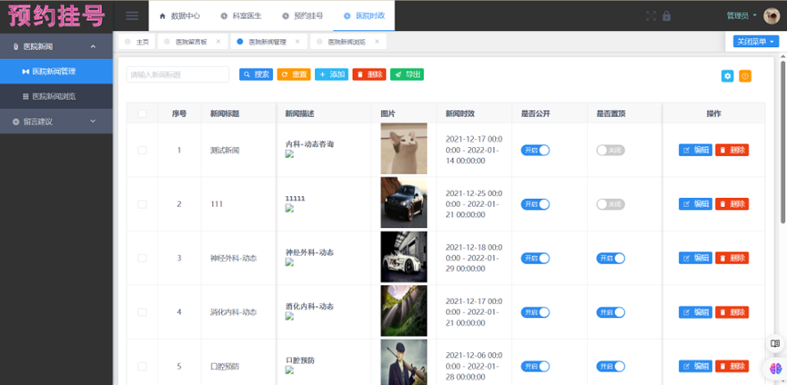

# registration

#### 介绍
医院预约挂号系统

#### 软件架构
后端：springboot+mysql+maven+redis
前端：vue
软件架构说明

#### 安装教程

1.  创建数据库order,执行数据库文件order.sql
2.  修改配置文件连接到redis和mysql数据库
3.  启动后端springboot项目
4.  前端删除node_modules,执行npm install
5.  前端启动： npm run dev

#### 使用说明

1．登录注册模块：用户可以进行登录和注册。

2．科室管理模块：管理员登陆系统后，可以进入科室管理模块，查询科室档案的详细数据。

3．医生管理模块：管理员登陆系统后，可以进入医生管理模块，查询医生档案的详细数据。

4．医生放号模块：管理员登陆系统后，可以对医生进行放号管理。

5．预约挂号模块：患者账号登陆系统后，可以进入到预约挂号模块。

6．我的挂号模块：患者登陆系统后，可以进入我的挂号模块。该模块用于展示个人的挂号详情。

7．用户留言模块：医院的预约挂号标准化流程，一定会存在有需要改进的点，或者现有功能不能被患者理解学会，所以需要设计留言板功能，实现患者和医院的信息交互功能。患者可以在服务结束后对医院进行留言，管理员可以对留言进行回复和管理。

8．医院新闻模块：管理员可以进入医院新闻模块，对医院的新闻进行添加、编辑、删除、公开、置顶。患者可以进入医院新闻模块，对医院的新闻进行浏览。

